<div align="center">

# 🍳 Cegin

**Your personal AI-powered recipe companion**

[](LICENSE)
[](https://hub.docker.com/r/callum2254/cegin)
[](https://github.com/cmadzz/cegin/releases)
[](https://nodejs.org)
[](https://expo.dev)
[](https://github.com/cmadzz/cegin)

[cegin.kitchen](https://cegin.kitchen) · [Documentation](docs/API.md) · [Report a Bug](https://github.com/cmadzz/cegin/issues)

</div>

---

Cegin is a self-hosted recipe management app with an AI cooking assistant named **Chef Terry**. Store and organize your recipes, plan weekly meals, generate smart shopping lists, and get real-time cooking help — all running on your own hardware with no cloud dependency.

<p align="center">
  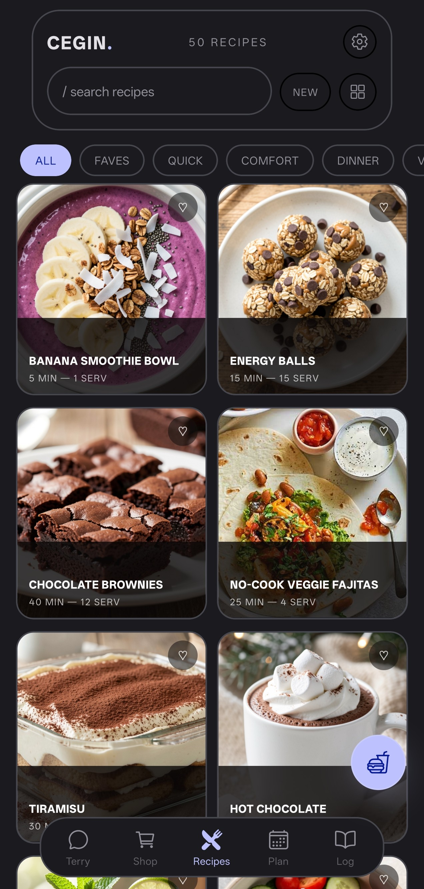
  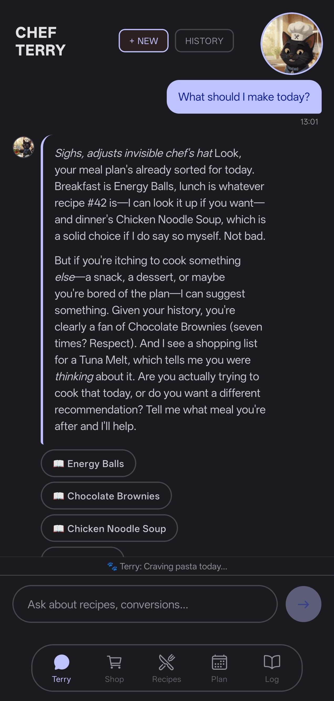
  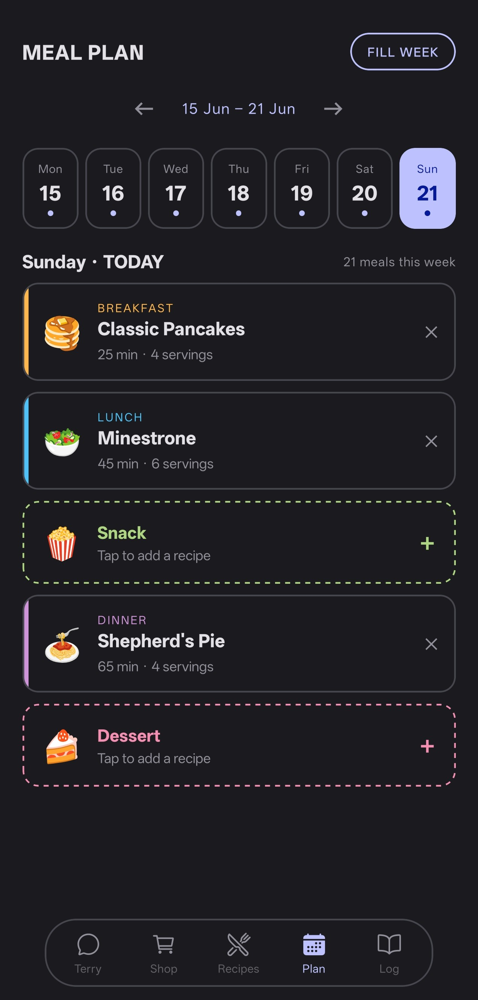
  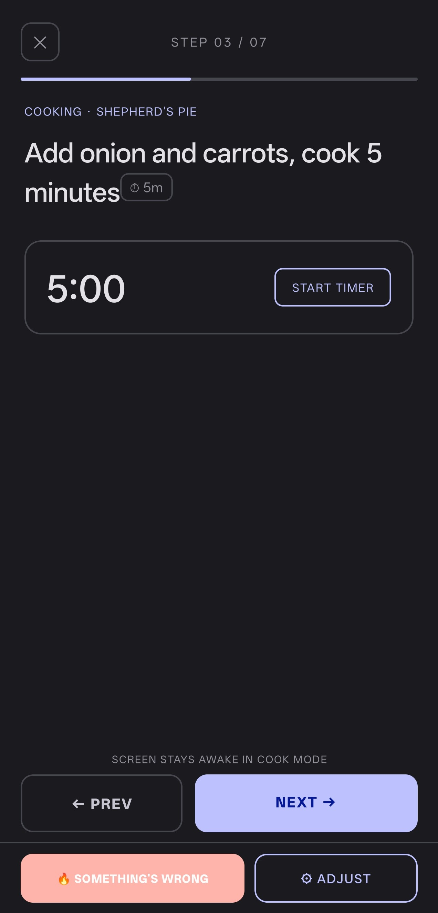
</p>
<p align="center">
  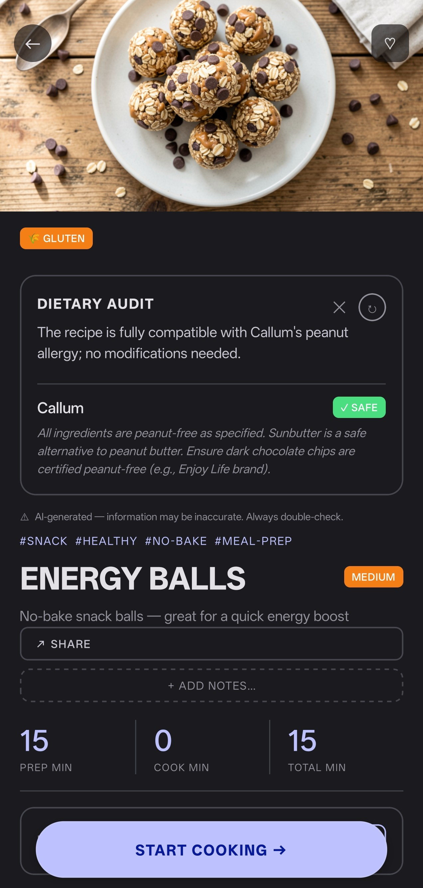
  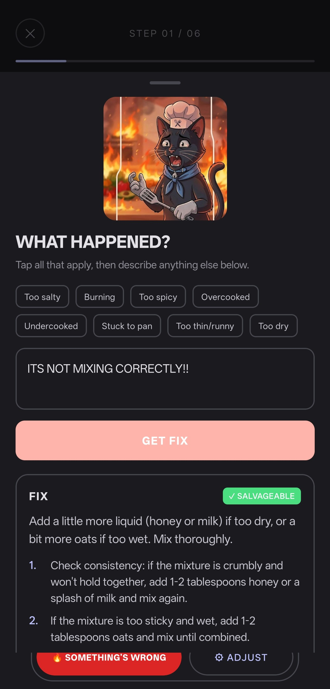
  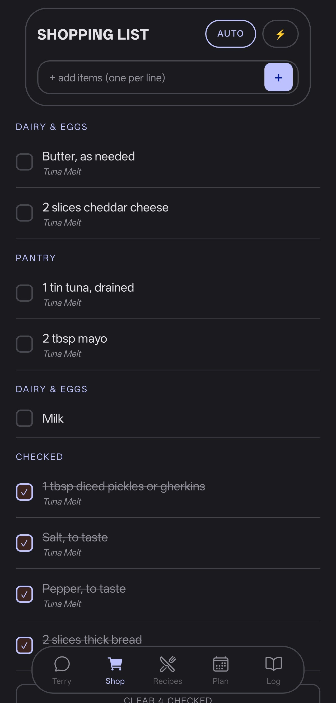
  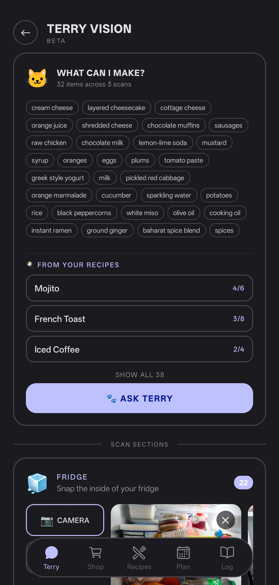
</p>
<p align="center">
  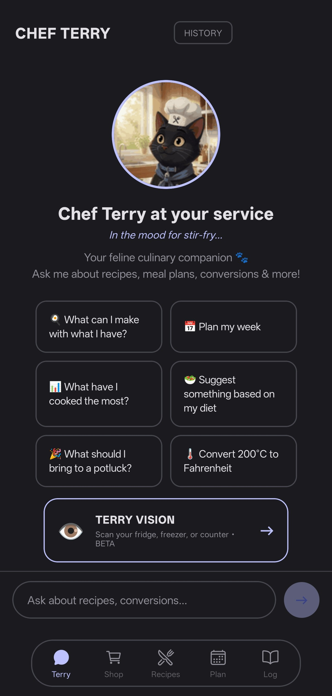
  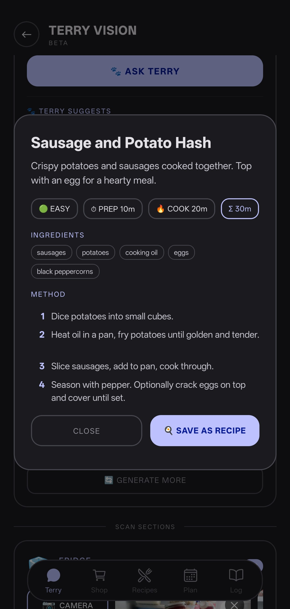
  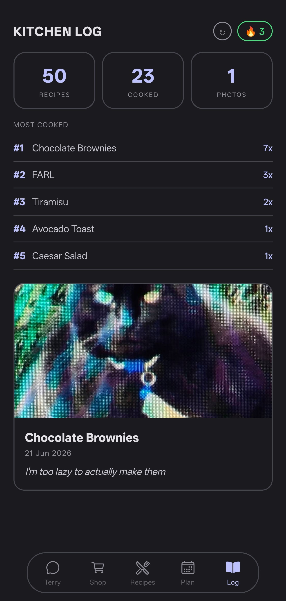
</p>

## ✨ Features

- **Recipe Management** — store, search, import from any URL, and organize recipes into collections
- **Smart Meal Planning** — AI-powered weekly meal plans based on your saved recipes and dietary needs
- **Shopping Lists** — auto-consolidate ingredients from multiple recipes, check items off as you shop
- **Chef Terry** — context-aware AI assistant that knows your recipes, pantry, and cooking history
- **Mid-Cook Panic Fix** — tell Terry what went wrong and get instant recovery suggestions
- **Terry Vision** — scan your fridge/pantry with your camera, get recipe suggestions from what you have
- **Cook Mode** — step-by-step cooking with built-in timers and keep-awake
- **USDA Nutrition** — look up nutritional data from the USDA database
- **Allergen Flags** — audit recipes against dietary profiles and allergen restrictions
- **Push Notifications** — morning meal prep reminders and perishable ingredient alerts
- **Offline-First** — works in local mode with zero server, or syncs with a self-hosted backend
- **Multi-Device Sync** — real-time WebSocket sync between all your devices
- **Multi-Image Recipes** — attach multiple photos to any recipe
- **Kitchen Log** — track your cooking history, streaks, and top recipes

## 🏗️ Tech Stack

| Layer | Technology |
|:------|:-----------|
| **Server** | Node.js, Express 5, better-sqlite3, WebSocket |
| **Mobile** | React Native, Expo SDK 56 |
| **AI (text)** | OpenAI-compatible API (DeepSeek, Groq, OpenAI, OpenRouter, Ollama) |
| **AI (vision)** | Gemini Vision (fridge scanning, photo import) |
| **Auth** | JWT (bcryptjs password hashing) |
| **Images** | sharp (on-the-fly resizing, JPEG optimisation) |
| **Deployment** | Docker (~100 MB image), Docker Compose secrets |
| **Security** | Helmet, rate limiting, SSRF protection, per-user data scoping |

## 🚀 Quick Start

### Option 1: Docker (recommended)

```bash
cd server
cp .env.example .env
# Edit .env — set your provider type, base URL, and model name
```

Set up secrets (API keys and JWT secret — never in `.env`):

```bash
mkdir -p secrets && chmod 700 secrets
echo "sk-your-text-key"        > secrets/TEXT_API_KEY
echo "AIza-your-vision-key"    > secrets/VISION_API_KEY
echo "your-jwt-secret"         > secrets/JWT_SECRET
chmod 600 secrets/*
```

Start the server:

```bash
docker compose up -d --build
```

The server will be available at `http://YOUR_LAN_IP:3000` (binds to `0.0.0.0`).

#### Minimum `.env` for AI features:

```env
TEXT_PROVIDER=openai-compatible
TEXT_BASE_URL=https://api.deepseek.com/v1
TEXT_MODEL=deepseek-chat
```

> **Note:** The API key goes in `secrets/TEXT_API_KEY`, not in `.env`.

#### Optional — vision (fridge scanning, photo import):

```env
VISION_PROVIDER=gemini
VISION_MODEL=gemini-2.5-flash
```

> **Note:** Vision key goes in `secrets/VISION_API_KEY`.

### Option 2: Local Development (no Docker)

```bash
# Server
cd server
npm install
node index.js

# Mobile (in a separate terminal)
cd mobile
npm install
npx expo start
```

Scan the QR code in Expo Go for quick testing. For push notifications and full native features, build a dev client or APK:

```bash
npx expo run:android     # Build and run on connected device
EXPO_GO=1 npx expo start # Expo Go mode (blocks expo-notifications)
```

> **Important:** Phone and server must be on the same Wi-Fi. The phone talks directly to your Docker container over LAN. No cloud.

## 📖 API Documentation

Full REST API documentation is available in [`docs/API.md`](docs/API.md).

Quick reference:

| Base URL | `http://YOUR_LAN_IP:3000/api` |
|:---------|:-------------------------------|
| Auth | JWT Bearer token in `Authorization` header |
| Health check | `GET /api/health` (no auth required) |
| AI status | `GET /api/ai/status` (no auth required) |

## 🏛️ Architecture

```
┌─────────────────────────────────────────────────────────────┐
│                        Mobile App                           │
│  ┌──────────┐  ┌──────────┐  ┌──────────┐  ┌──────────┐   │
│  │  Screens  │  │  Offline │  │  Local   │  │  Push    │   │
│  │  (RN)     │  │  Cache   │  │  AI      │  │  Notifs  │   │
│  └─────┬─────┘  └────┬─────┘  └────┬─────┘  └────┬─────┘   │
│        └──────────────┴─────────────┴─────────────┘         │
│                          │  HTTP / WebSocket                 │
└──────────────────────────┼──────────────────────────────────┘
                           │
┌──────────────────────────┼──────────────────────────────────┐
│                    Server (Docker)                           │
│  ┌──────────┐  ┌──────────┐  ┌──────────┐  ┌──────────┐   │
│  │  Express  │  │  SQLite  │  │  AI      │  │  Cron    │   │
│  │  API      │  │  (WAL)   │  │  Bridge  │  │  Jobs    │   │
│  └─────┬─────┘  └────┬─────┘  └────┬─────┘  └────┬─────┘   │
│        └──────────────┴─────────────┴─────────────┘         │
│                          │                                   │
│  ┌──────────┐  ┌──────────┐  ┌──────────┐                   │
│  │  Sharp    │  │  Helmet  │  │  JWT     │                   │
│  │  (images) │  │  (sec)   │  │  (auth)  │                   │
│  └──────────┘  └──────────┘  └──────────┘                   │
└─────────────────────────────────────────────────────────────┘
                           │
               ┌───────────┴───────────┐
               │    AI Providers       │
               │  DeepSeek │ Gemini    │
               │  Groq     │ Ollama    │
               │  OpenAI   │ OpenRouter│
               └───────────────────────┘
```

### Two Modes

| | Server Mode | Local Mode |
|:---|:---|:---|
| **Storage** | SQLite on server (Docker volume) | SQLite on phone |
| **AI** | Server-side via configured provider | Direct device-to-provider |
| **Sync** | Multi-device via WebSocket | Single device |
| **Auth** | JWT login required | None |
| **Push** | ✅ (native builds) | ❌ |

Switch modes anytime from Settings.

## 🤖 Chef Terry

Terry is a context-aware AI cooking assistant with personality. He knows your recipes, meal plan, shopping list, dietary profiles, and cooking history.

- **Chat** — ask about recipes, get suggestions, convert units, troubleshoot cooking problems
- **Mid-cook panic** — *"Something went wrong at step 3"* and Terry recalculates on the fly
- **Meal planning** — AI-powered weekly meal plans based on your saved recipes and dietary needs
- **Terry Vision** — snap a photo of your fridge, Terry identifies ingredients and suggests recipes
- **Recipe generation** — describe what you want and Terry creates a structured recipe
- **URL import** — paste a recipe URL and Terry extracts and formats it

### AI Providers

You're not locked into any provider. Change `TEXT_BASE_URL` and `TEXT_MODEL` in `.env`:

| Provider | Base URL | Example Model |
|:---------|:---------|:--------------|
| **DeepSeek** | `https://api.deepseek.com/v1` | `deepseek-chat` |
| **Groq** | `https://api.groq.com/openai/v1` | `llama-3.1-70b-versatile` |
| **OpenAI** | `https://api.openai.com/v1` | `gpt-4o-mini` |
| **OpenRouter** | `https://openrouter.ai/api/v1` | `anthropic/claude-sonnet-4` |
| **Ollama (local)** | `http://host.docker.internal:11434/v1` | `llama3.1` |

- Vision can be configured independently (e.g. Gemini for vision, local model for chat)
- The mobile app also supports **Custom AI Providers** (Settings → AI PROVIDERS) for direct device-to-provider calls

### Push Notifications (native builds)

- **Morning Digest** — 8:00 AM, Terry tells you what's for dinner and what to prep
- **Perishable Alerts** — every 6 hours, warns about expiring scanned items

## 🔒 Security

### Server (Docker)

- API keys and JWT secret stored as Docker Compose secrets — mounted at `/run/secrets/`
- Never visible via `docker inspect`, `docker exec env`, or image layers
- `secrets/` is in `.gitignore` and `.dockerignore`
- Container runs as non-root user
- Resource limits: 512 MB RAM, 1 CPU
- Rate limiting on auth (10/min) and AI routes (60/min)
- SSRF protection on image proxy (blocks private IPs)
- Helmet security headers
- Per-user data scoping on all endpoints

### Mobile (Local Mode)

- API keys in `expo-secure-store` (Android Keystore)
- Hardware-backed AES-256 encryption at rest
- In Expo Go, falls back to AsyncStorage (unencrypted)

## 💾 Backups & Data

Recipes are in a plain SQLite file on a Docker volume.

```bash
# Backup
docker run --rm -v cegin-data:/data -v "$PWD":/backup \
  alpine cp /data/recipes.db /backup/recipes.db.bak

# Restore — reverse the cp direction
```

- **Local mode:** data lives in the phone's SQLite (backed up with normal phone backups).

## 📁 Project Structure

```
cegin/
├── server/
│   ├── Dockerfile
│   ├── docker-compose.yml
│   ├── .env.example
│   ├── index.js          # Express API (routes, auth, endpoints)
│   ├── db.js             # SQLite schema + CRUD (recipes, meals, scans, tokens)
│   ├── ai.js             # AI provider integration (DeepSeek, Gemini, etc.)
│   ├── auth.js           # JWT auth + password hashing
│   ├── notifications.js  # Expo Push notification sender
│   ├── cron.js           # Scheduled jobs (morning digest, perishable alerts)
│   └── secrets.js        # Secret loading (Docker secrets > ./secrets/ > env vars)
├── mobile/
│   ├── App.js
│   └── src/
│       ├── api.js              # Server API client + offline cache
│       ├── mealPlan.js         # Meal planner (syncs to server)
│       ├── notifications.js    # Push notification registration
│       ├── offlineCache.js     # Offline-first recipe cache
│       ├── localAi.js          # Local mode AI providers
│       ├── usdaNutrition.js    # USDA nutrition database
│       ├── config.js           # Key storage (secure store)
│       └── screens/
│           ├── AssistantScreen.js    # Chef Terry chat
│           ├── TerryVisionScreen.js  # Fridge scanning
│           ├── MealPlannerScreen.js  # Weekly meal planning
│           ├── CookModeScreen.js     # Step-by-step cooking
│           ├── ShoppingListScreen.js
│           ├── RecipeListScreen.js
│           ├── RecipeDetailScreen.js
│           ├── EditRecipeScreen.js
│           ├── SettingsScreen.js
│           ├── CookbookScreen.js
│           ├── StatsScreen.js
│           └── SetupScreen.js
├── docs/                 # cegin.kitchen landing page (GitHub Pages)
├── docs/API.md           # REST API documentation
├── LICENSE
└── README.md
```

## 🛠️ Development

### Server (Docker — recommended)

```bash
cd server
docker compose up --build
```

### Server (without Docker)

```bash
cd server
npm install
node index.js
```

### Mobile

```bash
cd mobile
npx expo start           # Expo Go for quick dev testing
npx expo run:android     # Build and run on connected device
```

Push notifications require a native build — they don't work in Expo Go. Start Metro for Expo Go with:

```bash
EXPO_GO=1 npx expo start
```

*(This blocks `expo-notifications` from the bundle to prevent SDK 53+ crashes.)*

## 🐛 Troubleshooting

| Problem | Solution |
|:--------|:---------|
| Can't reach server from phone | Use the machine's LAN IP, not localhost. Check firewall. |
| AI not working | Check `TEXT_*` / `VISION_*` in `.env` and that `secrets/` files exist. Test at `/api/health` and `/api/ai/status`. |
| Database disappears | Make sure the `cegin-data` Docker volume exists. |
| Secrets not loading | Check `ls -la secrets/` — files need mode `600`. |
| After changing `.env` or Dockerfile | Use `docker compose up -d --build`. |
| better-sqlite3 build errors | `docker compose build --no-cache`. |

## 🤝 Contributing

Contributions are welcome! Here's how to get started:

1. **Fork** the repository
2. **Create** a feature branch (`git checkout -b feature/amazing-feature`)
3. **Commit** your changes (`git commit -m 'Add amazing feature'`)
4. **Push** to the branch (`git push origin feature/amazing-feature`)
5. **Open** a Pull Request

### Guidelines

- Follow existing code style and conventions
- Test your changes locally before submitting
- Keep PRs focused — one feature or fix per PR
- Update documentation if you change public APIs
- All contributions are licensed under GPL-3.0

## 📄 License

This project is licensed under the **GNU General Public License v3.0** — see the [LICENSE](LICENSE) file for details.

---

<p align="center">
  Enjoy cooking with Terry. 🐱
</p>
